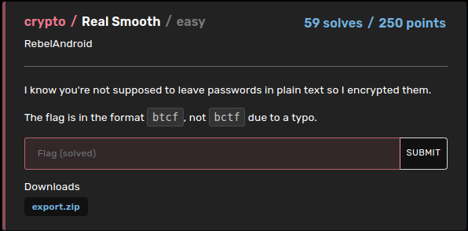
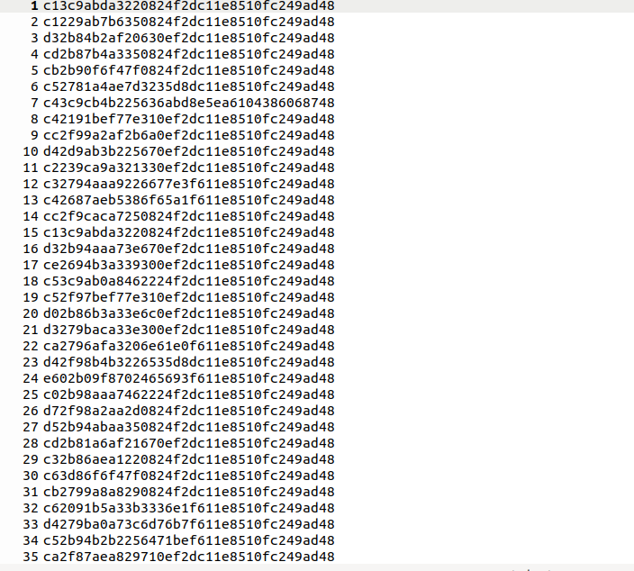
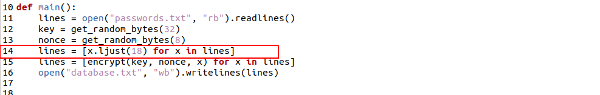
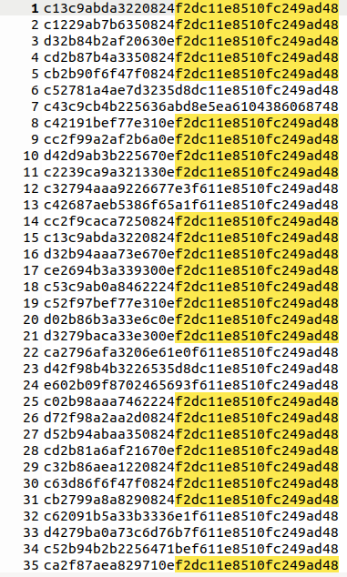
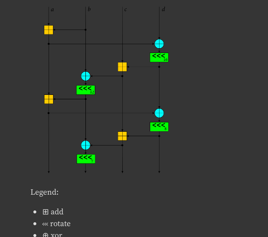

# Real Smooth : BuckeyeCTF 2023 writeup

## Challenge description




## Script :

```python
from Crypto.Cipher import ChaCha20
from Crypto.Random import get_random_bytes


def encrypt(key, nonce, plaintext):
    chacha = ChaCha20.new(key=key, nonce=nonce)
    return chacha.encrypt(plaintext)


def main():
    lines = open("passwords.txt", "rb").readlines()
    key = get_random_bytes(32)
    nonce = get_random_bytes(8)
    lines = [x.ljust(18) for x in lines]
    lines = [encrypt(key, nonce, x) for x in lines]
    open("database.txt", "wb").writelines(lines)


if __name__ == "__main__":
    main()
```


## Encrypted passwords :




We can understand from the script that we have a password list encrypted with chacha20 wich is similar to salsa20 (inspired by dances name's)


from the 14th line we know that passwords lengths are less or equal 18, and to fulfill the short ones, we add padding with spaces :




So we can say that we have informations about some prefixes of plaintext, that why we have common prefix between encrypted messages :




Before starting this challenge, my teammate told me that he found a vulnerability in this algorithm that mentioned that using the same key and nonce is unsafe, so i started from this hypothesis, i said by myself that there may be a way to recover the key and nonce but after seeing the oprations apllied in 20 round with this algorithm i gave up:





After exploring other solutions, i've found a video wich explain that chacha20 will just generate a byte key for each byte in the plain text, so the goal here is not to find the initial key but a byte XX with : a known plain text byte (xor)  XX  = the encrypted byte


To check that i took one line from the encrypted file and i tried to recover a key as following

```python
target = "cb2794a9a8290824f2dc11e8510fc249ad48"

key= ""
for i in range(0,len(target),2):	
	print(hex(int(target[i:i+2],16) ^ ord(" ")))
	key+= "{:02x}".format(int(target[i:i+2],16) ^ ord(" "))

```


## Result :
```
>>> key
'eb07b48988092804d2fc31c8712fe2698d68'
```

Now i have a key i'll loop over each line and check if i have something clear specially in the prefix:


```
f = open("file", "r")
data =[]
for line in f:
	data.append(line.replace("\n",""))


cs =[]
for d in data:
	c=""
	for i in range(0,len(d),2):
		c+= chr(int("{:02x}".format(int(d[i:i+2],16) ^ int(key[i:i+2],16)),16))
	cs.append((c+"\n").encode())
	
open("view", "wb").writelines(cs)
```


After checking the output file, i can say the idea worth it :

```
$&/*/&Cvic
       
* ~2D_pl41n73x7}
-%.&/O
           
"(/-7t
-<&;=11
         
+ /+,7K
          
(&-"($Ie
         
(,3'-.
",7+<)Knd
        
?9  %<
-:%(/6Nf
         
$,-"7 Kh
         
}xpt11
```
we have a part of the flag _pl41n73x7} (plainText in leet code)


At the begenning of the file i found a part of familiar password:


```
/;(=:,Knoronaldo
```

if we compare it with the flag prefix:

```
......._pl41n73x7}
/;(=:,Knoronaldo  
   
```
we can guess that the full password was "cristianioronaldo\n ":

```
......._pl41n73x7}
cristianoronaldo\n  

   
```

Lets recover a key from this and see what happen..


Now we have the flag splited in two lines:

```
romana
           
estupido
         
hondacivic
       
3_kn0wn_pl41n73x7}
aloha
            
nancy1
           
august11
         
.
.
.
.
remember
         
disneyland
       
renren
           
singapore
        
btcf{w3_d0_4_l177l
scoobydoo
        
loveyah
          
pineda
           
wilbur
           
khulet
           
jaguars
          

```


## Final flag :
```
btcf{w3_d0_4_l177l3_kn0wn_pl41n73x7}
```


We do a little known plainText  :)

