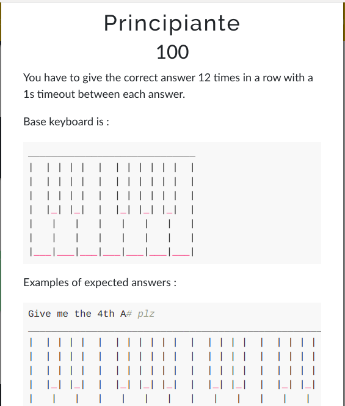

# DaVinciCTF 2023 writeup

## Challenge description




The idea of the challenge is being able to respond with the correct answer each time in short time (1 second as timeout) so it's impossible to do this by hand

as we have host to remote :


```
nc prog.dvc.tf 7751

```

The best thing to do is to open a socket with a program to respond quickly


The keyboard suggested was a little bit for me and didnt get why in the given example we answered that way :

```
Give me the 4th A# plz :

_________________________________________________________________________________________________________________
|  | | | |  |  | | | | | |  |  | | | |  |  | | | | | |  |  | | | |  |  | | | | | |  |  | | | |  |  | | | | | |  |
|  | | | |  |  | | | | | |  |  | | | |  |  | | | | | |  |  | | | |  |  | | | | | |  |  | | | |  |  | | | | | |  |
|  | | | |  |  | | | | | |  |  | | | |  |  | | | | | |  |  | | | |  |  | | | | | |  |  | | | |  |  | | | | |X|  |
|  |_| |_|  |  |_| |_| |_|  |  |_| |_|  |  |_| |_| |_|  |  |_| |_|  |  |_| |_| |_|  |  |_| |_|  |  |_| |_| |_|  |
|   |   |   |   |   |   |   |   |   |   |   |   |   |   |   |   |   |   |   |   |   |   |   |   |   |   |   |   |
|   |   |   |   |   |   |   |   |   |   |   |   |   |   |   |   |   |   |   |   |   |   |   |   |   |   |   |   |
|___|___|___|___|___|___|___|___|___|___|___|___|___|___|___|___|___|___|___|___|___|___|___|___|___|___|___|___|


```


Then i realised that we are dealing with a piano :)


## Tests 

when we make time to respond the host say that we are too slow :D


if the answer is wrong he is mad :o


Now lets start coding


First thing to do is opening a sokcet to the host:


```
import socket


s = socket.socket(socket.AF_INET, socket.SOCK_STREAM)
s.connect(("prog.dvc.tf", 7751))

data = s.recv(120)

```


Then we need to parse data : 

```
data = data.split(b"\n")[1].decode()
number = int(data.split("Give me the ")[1].split(" ")[0].replace("rd","").replace("nd","").replace("th","").replace("st",""))
note = data.split(" ")[4]
```

As we can see we need in each round to send n time the keyboard within the note in the last part, so (n-1) of simple keyboard and the last will have the note


I created a sipmple keyboad and a dictionary of keyboard of each note, in addition i removed the right border of the simple keyboard because when we concatinate with another one we will have also the left border of the second one :

```
keboad = ["____________________________",
	"|  | | | |  |  | | | | | |  ",
	"|  | | | |  |  | | | | | |  ",
	"|  | | | |  |  | | | | | |  ",
	"|  |_| |_|  |  |_| |_| |_|  ",
	"|   |   |   |   |   |   |   ",
	"|   |   |   |   |   |   |   ",
	"|___|___|___|___|___|___|___"]

resp = {
"C" : ["_____________________________"
	,"|  | | | |  |  | | | | | |  |"
	,"|  | | | |  |  | | | | | |  |"
	,"|  | | | |  |  | | | | | |  |"
	,"|  |_| |_|  |  |_| |_| |_|  |"
	,"|   |   |   |   |   |   |   |"
	,"| X |   |   |   |   |   |   |"
	,"|___|___|___|___|___|___|___|"],

"D" : ["_____________________________"
	,"|  | | | |  |  | | | | | |  |"
	,"|  | | | |  |  | | | | | |  |"
	,"|  | | | |  |  | | | | | |  |"
	,"|  |_| |_|  |  |_| |_| |_|  |"
	,"|   |   |   |   |   |   |   |"
	,"|   | X |   |   |   |   |   |"
	,"|___|___|___|___|___|___|___|"],

"E" : ["_____________________________"
	,"|  | | | |  |  | | | | | |  |"
	,"|  | | | |  |  | | | | | |  |"
	,"|  | | | |  |  | | | | | |  |"
	,"|  |_| |_|  |  |_| |_| |_|  |"
	,"|   |   |   |   |   |   |   |"
	,"|   |   | X |   |   |   |   |"
	,"|___|___|___|___|___|___|___|"],

"F" : ["_____________________________"
	,"|  | | | |  |  | | | | | |  |"
	,"|  | | | |  |  | | | | | |  |"
	,"|  | | | |  |  | | | | | |  |"
	,"|  |_| |_|  |  |_| |_| |_|  |"
	,"|   |   |   |   |   |   |   |"
	,"|   |   |   | X |   |   |   |"
	,"|___|___|___|___|___|___|___|"],

"G" : ["_____________________________"
	,"|  | | | |  |  | | | | | |  |"
	,"|  | | | |  |  | | | | | |  |"
	,"|  | | | |  |  | | | | | |  |"
	,"|  |_| |_|  |  |_| |_| |_|  |"
	,"|   |   |   |   |   |   |   |"
	,"|   |   |   |   | X |   |   |"
	,"|___|___|___|___|___|___|___|"],
"A" : ["_____________________________"
	,"|  | | | |  |  | | | | | |  |"
	,"|  | | | |  |  | | | | | |  |"
	,"|  | | | |  |  | | | | | |  |"
	,"|  |_| |_|  |  |_| |_| |_|  |"
	,"|   |   |   |   |   |   |   |"
	,"|   |   |   |   |   | X |   |"
	,"|___|___|___|___|___|___|___|"],
"B" : ["_____________________________"
	,"|  | | | |  |  | | | | | |  |"
	,"|  | | | |  |  | | | | | |  |"
	,"|  | | | |  |  | | | | | |  |"
	,"|  |_| |_|  |  |_| |_| |_|  |"
	,"|   |   |   |   |   |   |   |"
	,"|   |   |   |   |   |   | X |"
	,"|___|___|___|___|___|___|___|"],
"C#" : ["_____________________________"
	,"|  | | | |  |  | | | | | |  |"
	,"|  | | | |  |  | | | | | |  |"
	,"|  |X| | |  |  | | | | | |  |"
	,"|  |_| |_|  |  |_| |_| |_|  |"
	,"|   |   |   |   |   |   |   |"
	,"|   |   |   |   |   |   |   |"
	,"|___|___|___|___|___|___|___|"],
"D#" : ["_____________________________"
	,"|  | | | |  |  | | | | | |  |"
	,"|  | | | |  |  | | | | | |  |"
	,"|  | | |X|  |  | | | | | |  |"
	,"|  |_| |_|  |  |_| |_| |_|  |"
	,"|   |   |   |   |   |   |   |"
	,"|   |   |   |   |   |   |   |"
	,"|___|___|___|___|___|___|___|"],
"F#" : ["_____________________________"
	,"|  | | | |  |  | | | | | |  |"
	,"|  | | | |  |  | | | | | |  |"
	,"|  | | | |  |  |X| | | | |  |"
	,"|  |_| |_|  |  |_| |_| |_|  |"
	,"|   |   |   |   |   |   |   |"
	,"|   |   |   |   |   |   |   |"
	,"|___|___|___|___|___|___|___|"],
"G#" : ["_____________________________"
	,"|  | | | |  |  | | | | | |  |"
	,"|  | | | |  |  | | | | | |  |"
	,"|  | | | |  |  | | |X| | |  |"
	,"|  |_| |_|  |  |_| |_| |_|  |"
	,"|   |   |   |   |   |   |   |"
	,"|   |   |   |   |   |   |   |"
	,"|___|___|___|___|___|___|___|"],
"A#" : ["_____________________________"
	,"|  | | | |  |  | | | | | |  |"
	,"|  | | | |  |  | | | | | |  |"
	,"|  | | | |  |  | | | | |X|  |"
	,"|  |_| |_|  |  |_| |_| |_|  |"
	,"|   |   |   |   |   |   |   |"
	,"|   |   |   |   |   |   |   |"
	,"|___|___|___|___|___|___|___|"]
}
```
 

Now ill loop in while loop, parse recvied data and prepare the answer as following : 


```
def concatPiano(length,keboad,key):
	res = []
	for i in range(0,len(keboad)):
		res.append(keboad[i]*(length-1)+key[i])
	return "\n".join(res)
```


**NB:** the answer should be sent encoded in bytes

```
s.sendall(concatPiano(number,keboad,resp[note]).encode(encoding = 'UTF-8')+ b"\n")

```

## Final code:

```
import socket
from timeit import default_timer

s = socket.socket(socket.AF_INET, socket.SOCK_STREAM)

s.connect(("prog.dvc.tf", 7751))
t = default_timer()
data = s.recv(120)

data = data.split(b"\n")[1].decode()
number = int(data.split("Give me the ")[1].split(" ")[0].replace("rd","").replace("nd","").replace("th","").replace("st",""))
print(number)
note = data.split(" ")[4]
print(note)


def concatPiano(length,keboad,key):
	res = []
	for i in range(0,len(keboad)):
		res.append(keboad[i]*(length-1)+key[i])
	return "\n".join(res)


keboad = ["____________________________",
	"|  | | | |  |  | | | | | |  ",
	"|  | | | |  |  | | | | | |  ",
	"|  | | | |  |  | | | | | |  ",
	"|  |_| |_|  |  |_| |_| |_|  ",
	"|   |   |   |   |   |   |   ",
	"|   |   |   |   |   |   |   ",
	"|___|___|___|___|___|___|___"]

resp = {
"C" : ["_____________________________"
	,"|  | | | |  |  | | | | | |  |"
	,"|  | | | |  |  | | | | | |  |"
	,"|  | | | |  |  | | | | | |  |"
	,"|  |_| |_|  |  |_| |_| |_|  |"
	,"|   |   |   |   |   |   |   |"
	,"| X |   |   |   |   |   |   |"
	,"|___|___|___|___|___|___|___|"],

"D" : ["_____________________________"
	,"|  | | | |  |  | | | | | |  |"
	,"|  | | | |  |  | | | | | |  |"
	,"|  | | | |  |  | | | | | |  |"
	,"|  |_| |_|  |  |_| |_| |_|  |"
	,"|   |   |   |   |   |   |   |"
	,"|   | X |   |   |   |   |   |"
	,"|___|___|___|___|___|___|___|"],

"E" : ["_____________________________"
	,"|  | | | |  |  | | | | | |  |"
	,"|  | | | |  |  | | | | | |  |"
	,"|  | | | |  |  | | | | | |  |"
	,"|  |_| |_|  |  |_| |_| |_|  |"
	,"|   |   |   |   |   |   |   |"
	,"|   |   | X |   |   |   |   |"
	,"|___|___|___|___|___|___|___|"],

"F" : ["_____________________________"
	,"|  | | | |  |  | | | | | |  |"
	,"|  | | | |  |  | | | | | |  |"
	,"|  | | | |  |  | | | | | |  |"
	,"|  |_| |_|  |  |_| |_| |_|  |"
	,"|   |   |   |   |   |   |   |"
	,"|   |   |   | X |   |   |   |"
	,"|___|___|___|___|___|___|___|"],

"G" : ["_____________________________"
	,"|  | | | |  |  | | | | | |  |"
	,"|  | | | |  |  | | | | | |  |"
	,"|  | | | |  |  | | | | | |  |"
	,"|  |_| |_|  |  |_| |_| |_|  |"
	,"|   |   |   |   |   |   |   |"
	,"|   |   |   |   | X |   |   |"
	,"|___|___|___|___|___|___|___|"],
"A" : ["_____________________________"
	,"|  | | | |  |  | | | | | |  |"
	,"|  | | | |  |  | | | | | |  |"
	,"|  | | | |  |  | | | | | |  |"
	,"|  |_| |_|  |  |_| |_| |_|  |"
	,"|   |   |   |   |   |   |   |"
	,"|   |   |   |   |   | X |   |"
	,"|___|___|___|___|___|___|___|"],
"B" : ["_____________________________"
	,"|  | | | |  |  | | | | | |  |"
	,"|  | | | |  |  | | | | | |  |"
	,"|  | | | |  |  | | | | | |  |"
	,"|  |_| |_|  |  |_| |_| |_|  |"
	,"|   |   |   |   |   |   |   |"
	,"|   |   |   |   |   |   | X |"
	,"|___|___|___|___|___|___|___|"],
"C#" : ["_____________________________"
	,"|  | | | |  |  | | | | | |  |"
	,"|  | | | |  |  | | | | | |  |"
	,"|  |X| | |  |  | | | | | |  |"
	,"|  |_| |_|  |  |_| |_| |_|  |"
	,"|   |   |   |   |   |   |   |"
	,"|   |   |   |   |   |   |   |"
	,"|___|___|___|___|___|___|___|"],
"D#" : ["_____________________________"
	,"|  | | | |  |  | | | | | |  |"
	,"|  | | | |  |  | | | | | |  |"
	,"|  | | |X|  |  | | | | | |  |"
	,"|  |_| |_|  |  |_| |_| |_|  |"
	,"|   |   |   |   |   |   |   |"
	,"|   |   |   |   |   |   |   |"
	,"|___|___|___|___|___|___|___|"],
"F#" : ["_____________________________"
	,"|  | | | |  |  | | | | | |  |"
	,"|  | | | |  |  | | | | | |  |"
	,"|  | | | |  |  |X| | | | |  |"
	,"|  |_| |_|  |  |_| |_| |_|  |"
	,"|   |   |   |   |   |   |   |"
	,"|   |   |   |   |   |   |   |"
	,"|___|___|___|___|___|___|___|"],
"G#" : ["_____________________________"
	,"|  | | | |  |  | | | | | |  |"
	,"|  | | | |  |  | | | | | |  |"
	,"|  | | | |  |  | | |X| | |  |"
	,"|  |_| |_|  |  |_| |_| |_|  |"
	,"|   |   |   |   |   |   |   |"
	,"|   |   |   |   |   |   |   |"
	,"|___|___|___|___|___|___|___|"],
"A#" : ["_____________________________"
	,"|  | | | |  |  | | | | | |  |"
	,"|  | | | |  |  | | | | | |  |"
	,"|  | | | |  |  | | | | |X|  |"
	,"|  |_| |_|  |  |_| |_| |_|  |"
	,"|   |   |   |   |   |   |   |"
	,"|   |   |   |   |   |   |   |"
	,"|___|___|___|___|___|___|___|"]
}

concatPiano(number,keboad,resp[note])
print(concatPiano(number,keboad,resp[note]))
s.sendall(concatPiano(number,keboad,resp[note]).encode(encoding = 'UTF-8')+ b"\n")
data = s.recv(120)
print(data.decode())

while True:
	data = data.split(b"\n")[1].decode()
	number = int(data.split("Give me the ")[1].split(" ")[0].replace("rd","").replace("nd","").replace("th","").replace("st",""))
	print(number)
	note = data.split(" ")[4]
	print(note)
	print(concatPiano(number,keboad,resp[note]))
	s.sendall(concatPiano(number,keboad,resp[note]).encode(encoding = 'UTF-8')+ b"\n")
	data = s.recv(120)
	print(data.decode())

```
## Recored video :
For ore fun i've recorded a video of the interaction with the host :

https://user-images.githubusercontent.com/32133781/224827217-95bded2b-c4df-4b3b-a663-5554899147f1.mp4


## Result :
```
Noice, here is your flag : dvCTF{4r3_Y0U_7H3_N3X7_M0Z4r7?}

=> are you the next mozart?
```


