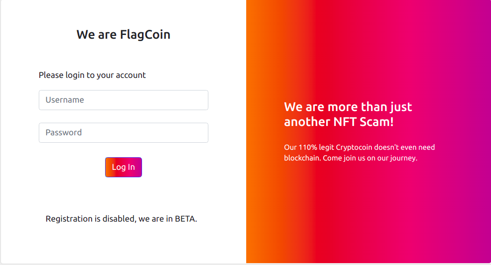
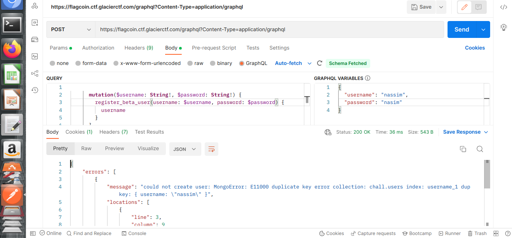

# isitdtu CTF 2022 writeup

## Challenge description


[link to challenge](https://flagcoin.ctf.glacierctf.com/)


When we open the websie we have a simple login from :





First thing i tried is sql injection but it didnt work so i decided to follow my network activity in chrome and i found this request :


After few researchs i realised that's **GraphQL** is data query and manipulation language for APIs developed by Facebook


Let's see in google if vulinirabilities exists in this one..,and i found this blog : 

[link to the blog](https://blog.yeswehack.com/yeswerhackers/how-exploit-graphql-endpoint-bug-bounty)


As mentioned in the blog we can send this request wich is able to show us back the full schema 
(query, mutation, objects, fields…):

```
{__schema{queryType{name}mutationType{name}subscriptionType{name}types{...FullType}directives{name description locations args{...InputValue}}}}fragment FullType on __Type{kind name description fields(includeDeprecated:true){name description args{...InputValue}type{...TypeRef}isDeprecated deprecationReason}inputFields{...InputValue}interfaces{...TypeRef}enumValues(includeDeprecated:true){name description isDeprecated deprecationReason}possibleTypes{...TypeRef}}fragment InputValue on __InputValue{name description type{...TypeRef}defaultValue}fragment TypeRef on __Type{kind name ofType{kind name ofType{kind name ofType{kind name ofType{kind name ofType{kind name ofType{kind name ofType{kind name}}}}}}}}
```

Let's try this on postman..


Interesting! We have a function called registered_beta_user in same level as login. this time i'll copy my query and variable from chrome network tab and replace the login by this function and use my first_name as login & password : 


After a second try i've got this message : 



 

So we are registred! Let's go back to chrome and try to login.. and here is our flag ^^


