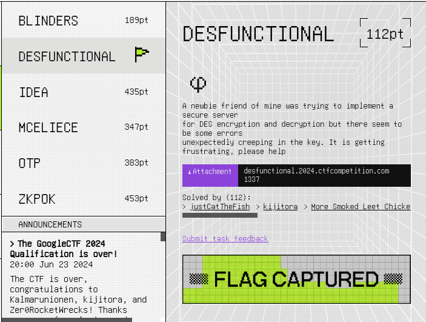
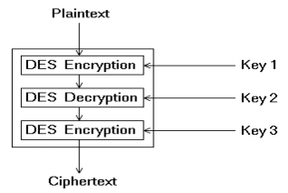

# GoogleCTF 2024 writeup

## Challenge description




## Script :

```python
import signal
import os
import random
import sys
from Crypto.Cipher import DES3


class Desfunctional:
    def __init__(self):
        self.key = os.urandom(24)
        self.iv = os.urandom(8)
        self.flipped_bits = set(range(0, 192, 8))
        self.challenge = os.urandom(64)
        self.counter = 128

    def get_flag(self, plain):
        if plain == self.challenge:
            with open("flag.txt", "rb") as f:
                FLAG = f.read()
            return FLAG
        raise Exception("Not quite right")

    def get_challenge(self):
        cipher = DES3.new(self.key, mode=DES3.MODE_CBC, iv=self.iv)
        return cipher.encrypt(self.challenge)

    def corruption(self):
        if len(self.flipped_bits) == 192:
            self.flipped_bits = set(range(0, 192, 8))
        remaining = list(set(range(192)) - self.flipped_bits)
        num_flips = random.randint(1, len(remaining))
        self.flipped_bits = self.flipped_bits.union(
            random.choices(remaining, k=num_flips))
        mask = int.to_bytes(sum(2**i for i in self.flipped_bits), 24)
        return bytes(i ^ j for i, j in zip(self.key, mask))

    def decrypt(self, text: bytes):
        self.counter -= 1
        if self.counter < 0:
            raise Exception("Out of balance")
        key = self.corruption()
        if len(text) % 8 != 0:
            return b''
        cipher = DES3.new(key, mode=DES3.MODE_CBC, iv=self.iv)
        return cipher.decrypt(text)


if __name__ == "__main__":
    chall = Desfunctional()
    PROMPT = ("Choose an API option\n"
              "1. Get challenge\n"
              "2. Decrypt\n"
              "3. Get the flag\n")
    signal.alarm(128)
    while True:
        try:
            option = int(input(PROMPT))
            if option == 1:
                print(chall.get_challenge().hex())
            elif option == 2:
                ct = bytes.fromhex(input("(hex) ct: "))
                print(chall.decrypt(ct).hex())
            elif option == 3:
                pt = bytes.fromhex(input("(hex) pt: "))
                print(chall.get_flag(pt))
                sys.exit(0)
        except Exception as e:
            print(e)
            sys.exit(1)
```

## Understanding the script :

The script is generating a variable called challenge with 64 bytes length, then suggesting 3 options:

1) get the challenge:

	return challenge variable encrypted with DES3 with the key

3) Decrypt:

	decrypt a given hex value with the key

5) Get the flag:

	asks for the original challenge value and print the flag if the value is correct


So our goal is to decrypt the challenge value once we have it encrypted, the problem here is that the server will decrypt the cipher value with a corrupted key and will not get the original value

First i tried to understand DES3 (also named triple DES), it is a DES variant with 3 iterations as following:


 

Now we can understand why the bloc size is 8 and the key length is 24 (3 keys)


Let's take a loock on corruption function:

```python
def corruption(self):
    if len(self.flipped_bits) == 192:
        self.flipped_bits = set(range(0, 192, 8))
    remaining = list(set(range(192)) - self.flipped_bits)
    num_flips = random.randint(1, len(remaining))
    self.flipped_bits = self.flipped_bits.union(
        random.choices(remaining, k=num_flips))
    mask = int.to_bytes(sum(2**i for i in self.flipped_bits), 24)
    return bytes(i ^ j for i, j in zip(self.key, mask))
```

This function is called every time we ask for decryption, to generate a corrupted key by xoring the original key with some bytes


`flipped_bits` is a set of values from 0 to 192 with 8 steps while `remaining` is the rest of number out of this set

Each round we add random values from `remaining` to `flipped_bits` till the first one become empty then we reset `flipped_bits` at the initial case and we continue the process while the limit is not achieved, then `flipped_bits` in bytes will be xored with the key to generate the new key as following

```
sum(2**i for i in self.flipped_bits)
```


So for me the best case was to use the initial value of `flipped_bits` to decrypt the cipher correctly, because its bytes value is :

```
'\x01'*24
```

and this wont affect the key because the last bit of each bytes in DES key is a paraity bit so we dont take it into account so `00000001` is the same as `00000000` and we will only use the first 7 bits


but unfortently we ll never get that because in the first round we will add at least one number from the `remaining` list


The other thing i noticed in the last step when the `remaining` becomes empty we xor `'\xff'*24` with the key, so i said by my self this could be interesting


After many test on local, i realised that `'\xff'*24` will give us the original key with flipped bits, and if we
send the cipher flipped we ll have something close to the challenge value, except the first 8 bytes and i didnt got it why, but i tried to xor the result with the excpected and i found `'\xff'*8` as result so all we need to do is to xor the first bloc with `'\xff'*8`

So the idea is to lunch the script and ask for decryption for the cipher xor  `b"\xff"*64` once `remaining` is empty. With randomness i noticed that is around the 8th to 12th round

## script :
```python
import socket

find = False
while not(find):
	s = socket.socket(socket.AF_INET, socket.SOCK_STREAM)
	s.connect(("desfunctional.2024.ctfcompetition.com", 1337))
	data = s.recv(1200)
	data = data.decode().split("\n")
	data = s.recv(1200)
	data = data.decode().split("\n")
	s.sendall(str(1).encode(encoding = 'UTF-8')+ b"\n")
	data = s.recv(1200)
	data = data.decode().split("\n")
	challenge = data[0]
	t=bytes(i ^ j for i, j in zip(bytes.fromhex(challenge), b"\xff"*64))

	i=0
	while i < 10:
		s.sendall(str(2).encode(encoding = 'UTF-8')+ b"\n")
		data = s.recv(1200)
		data = data.decode().split("\n")
		s.sendall(str(t.hex()).encode(encoding = 'UTF-8')+ b"\n")
		data = s.recv(1200)
		data = data.decode().split("\n")
		d=data[0]
		i+=1
		
	s.sendall(str(3).encode(encoding = 'UTF-8')+ b"\n")
	data = s.recv(1200)
	data = data.decode().split("\n")
	bd = bytes.fromhex(d)
	bd=bytes(i ^ j for i, j in zip(bd[0:8],b"\xff"*8))+bd[8:]
	s.sendall(str(bd.hex()).encode(encoding = 'UTF-8')+ b"\n")
	data = s.recv(1200)
	data = data.decode().split("\n")
	if(data[0] != 'Not quite right'):
		find = True
		print(data)
```

## flag :
```
CTF{y0u_m4y_NOT_g3t_th3_k3y_but_y0u_m4y_NOT_g3t_th3_c1ph3rt3xt_as_w3ll}
```


 


