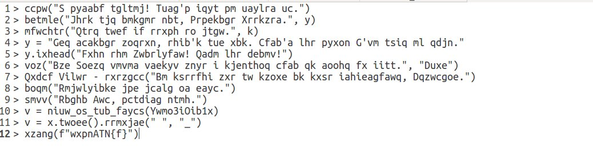

# jadeCTF 2022 writeup

## Challenge description


## File content



## Solution 

After reading "???: is this in german?" i recognized it's about vigenere so i triyed to find something 
in cipher text using one time pad tools : [one tiem pad tool](https://www.boxentriq.com/code-breaking/one-time-pad)

First thing to do in general is trying to guess some part text. in my case i found 3 words : 


i stared sliding on my text to exract the key : 


the is little bite strager and made no sens but i didnt gave up i tried with another line..


the key is nearly the same so we are in right path, lets try this time with verbose line


So the key is : yaiisananxmj

**trick:**
the letter 'A' is neutral element we can use it as padding
in order to have speceif letter in plain text we type it in key then we replace it by it's mirror in the plain text

Now we have they key let's make it more clear with keeping special chars and back lines, for this i used this online tool : [crypti](https://cryptii.com/pipes/vigenere-cipher)

Result : 
```
> echo("A planet killer! That's what he called it.")
> delete("When has become now, Director Krennic.", y)
> execute("This town is ready to blow.", x)
> y = "The reactor module, that's the key. That's the place I've laid my trap."
> y.append("Save the Rebellion! Save the dream!")
> xor("The Force moves darkly near a creature that is about to kill.", "Luke")
> Darth Vader - execute("Be careful not to choke on your aspirations, Director.")
> echo("Rebellions are built on hope.")
> send("Rogue One, pulling away.")
> x = name_of_the_track(Qemb3iBlp1o)
> x = x.lower().replace(" ", "_")
> print(f"jadeCTF{x}")
```

apparently we are not done yet, after reading this (btw it's star wars dialogue) i said by myself wich langage it could be ! Should i use xor.. I tried many options, then i searched if there is a function wich return track by id, i found some spotify APIs who does the job but id hasnt not same lenght as our "Qemb3iBlp1o" hence i checked in youtube v=Qemb3iBlp1o  and i was satisfied :) [the song](https://www.youtube.com/watch?v=Qemb3iBlp1o)


as written in the penultimate line we should transform song title in lower case and replace " " by "_" so the flag will be jadeCTF{your_father_would_be_proud}
