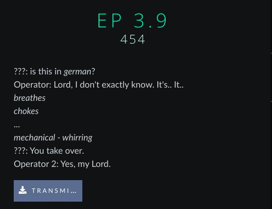
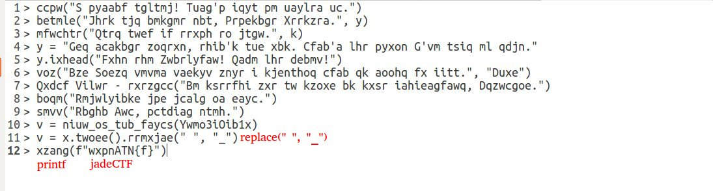
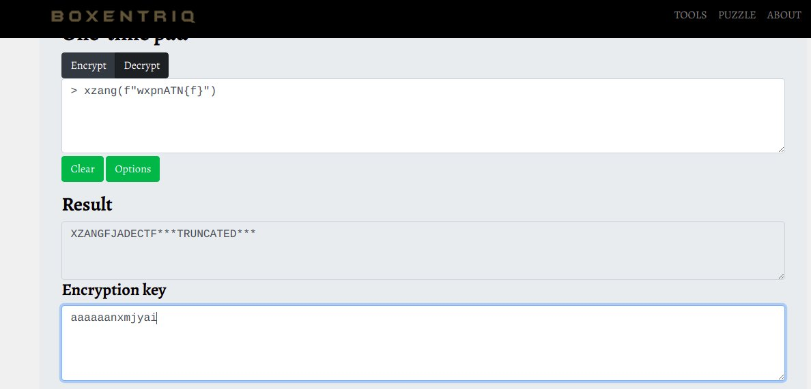
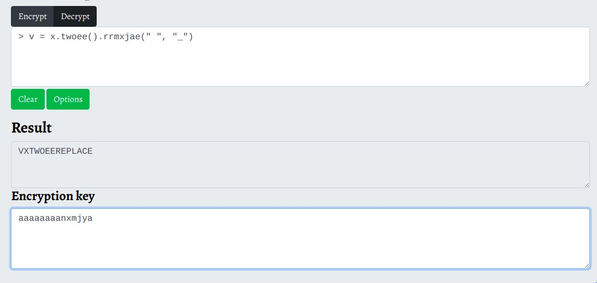
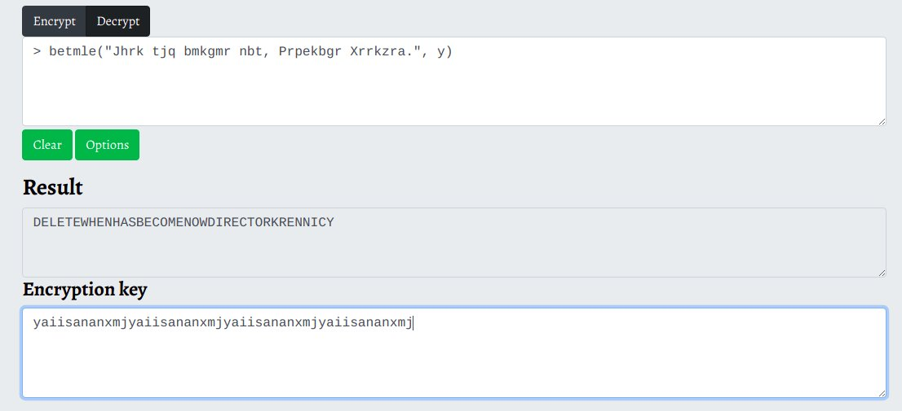

# jadeCTF 2022 writeup

## Challenge description



## File content
```
> ccpw("S pyaabf tgltmj! Tuag'p iqyt pm uaylra uc.")
> betmle("Jhrk tjq bmkgmr nbt, Prpekbgr Xrrkzra.", y)
> mfwchtr("Qtrq twef if rrxph ro jtgw.", k)
> y = "Geq acakbgr zoqrxn, rhib'k tue xbk. Cfab'a lhr pyxon G'vm tsiq ml qdjn."
> y.ixhead("Fxhn rhm Zwbrlyfaw! Qadm lhr debmv!")
> voz("Bze Soezq vmvma vaekyv znyr i kjenthoq cfab qk aoohq fx iitt.", "Duxe")
> Qxdcf Vilwr - rxrzgcc("Bm ksrrfhi zxr tw kzoxe bk kxsr iahieagfawq, Dqzwcgoe.")
> boqm("Rmjwlyibke jpe jcalg oa eayc.")
> smvv("Rbghb Awc, pctdiag ntmh.")
> v = niuw_os_tub_faycs(Ywmo3iOib1x)
> v = x.twoee().rrmxjae(" ", "_")
> xzang(f"wxpnATN{f}")
```

## Solution 

After reading "???: is this in german?" i realised it's about vigenere so i triyed to find something 
in cipher text using one time pad tools : [one tiem pad tool](https://www.boxentriq.com/code-breaking/one-time-pad)

First thing to do in general is trying to guess some part of text. in my case i found 3 words : 




I stared sliding on my text to exract the key : 



This is little bit stranger and made no sens but i didn't give up and i tried with another line..


The key is nearly the same so we are in right path, let's try this time with verbose line


So the key is : yaiisananxmj

**trick:**
The letter 'A' is neutral element we can use it as padding

In order to have speceif letter in plain text we type it in key then we replace it by it's mirror in the plain text

Now we have they key let's make it more clear with keeping special chars and back lines, for this i used this online tool : [crypti](https://cryptii.com/pipes/vigenere-cipher)

## Result
```
> echo("A planet killer! That's what he called it.")
> delete("When has become now, Director Krennic.", y)
> execute("This town is ready to blow.", x)
> y = "The reactor module, that's the key. That's the place I've laid my trap."
> y.append("Save the Rebellion! Save the dream!")
> xor("The Force moves darkly near a creature that is about to kill.", "Luke")
> Darth Vader - execute("Be careful not to choke on your aspirations, Director.")
> echo("Rebellions are built on hope.")
> send("Rogue One, pulling away.")
> x = name_of_the_track(Qemb3iBlp1o)
> x = x.lower().replace(" ", "_")
> print(f"jadeCTF{x}")
```

Apparently we are not done yet, after reading this (btw it's star wars dialogue) i said by myself wich langage it could be ! Should i use xor.. I tried many options, then i searched if there is a function wich return track by id, i found some spotify APIs who does the job but id hasn't same lenght as our "Qemb3iBlp1o" hence i checked in youtube v=Qemb3iBlp1o  and i was satisfied :) [the song](https://www.youtube.com/watch?v=Qemb3iBlp1o)


As written in the penultimate line we should transform song title in lower case and replace " " by "_"

So the flag will be **jadeCTF{your_father_would_be_proud}**
