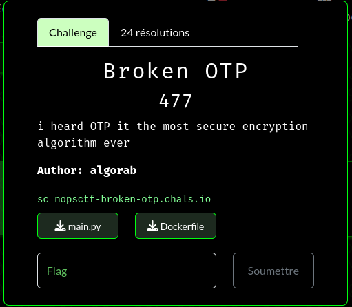

# N0PSctf 2024 Broken OTP writeup

## Challenge description




## Script :


```python 
import random

secret = 'XXXXXXXXXXXXXXXXXXXX'

PINK = 118
RED = 101
YELLOW = 97
GREEN = 108
BLACK = __builtins__
PURPLE = dir
e = getattr(BLACK, bytes([RED, PINK, YELLOW, GREEN]).decode())
g = e(''.__dir__()[4].strip('_')[:7])
b = g(BLACK, PURPLE(BLACK)[92])
i = g(BLACK, PURPLE(BLACK)[120])
t = ['74696d65', '72616e646f6d', '5f5f696d706f72745f5f', '726f756e64', '73656564']
d = lambda x: b.fromhex(x).decode()
fb = g(i, PURPLE(i)[-6])
_i = lambda x: e(d(t[2]))(x)
s = lambda: g(BLACK,d(t[3]))(g(_i(d(t[0])), d(t[0]))()) + fb(secret.encode())
r = g(_i(d(t[1])), d(t[4]))

def kg(l):
    return bytes([random.randint(0,255) for i in range(l)])

def c(p):
    k = kg(len(p))
    return bytes([k[i] ^ p[i] for i in range(len(p))]).hex()

if __name__ == '__main__':
    r(s())
    print("Welcome to our encryption service.")
    choice = input("Choose between:\n1. Encrypt your message.\n2. Get the encrypted secret.\nEnter your choice: ")
    match choice:
        case "1":
            message = input("Please enter the message you wish to encrypt: ")
            print(f"Your encrypted message is: {c(message.encode())}")
        case "2":
            print(f"The secret is: {c(secret.encode())}")
        case _:
            print("Invalid option!")
```

First thing we need to do is understaning the code specialy with theese weird functions calls, for the better understanding i launched few of them in python (version 3.12) and i quickly understood that:

`g` is generating timestamp:

```python
>>> g(BLACK,d(t[3]))(g(_i(d(t[0])), d(t[0]))())
1717433968
```

`fb` is a bytes to long function

```python
>>> fb(secret.encode())
504361349353409634517350059917776100900870838360
```

`s` is the addition of secret and timestamp


`r` is a random initialisation with `s` as seed


Cool it seems to be RNG problem, so after fixing the seed of the pseudo random, the script will give us 2 suggestions:

-Encrypting a custom message 
-Encrypting the secret value

The encreption function is an xor with key generated randomly in loop
```python
def kg(l):
    return bytes([random.randint(0,255) for i in range(l)])

def c(p):
    k = kg(len(p))
    return bytes([k[i] ^ p[i] for i in range(len(p))]).hex()
```

So first thing i did is to send `'\x00' * len(SECRET)` to the server to retrieve the key values for my current time, and i tried to recover the seed value using different tools like `randcrack` or `v8_rand_buster` but it didnt work for me


Then i've got an idea, i said by myself the secret value is always the same and the time is in seconds so in theory 
if we open 2 sockets to the server in nearly the main time, the seed will be the same..

And all i have to do is xor the result of `xor(0-bytes)` wich gives us the key values with `xor(secret)`

## My script :

```python
import socket

def xor(v,k):
    return bytes([v[i] ^ k[i] for i in range(len(v))])
    

#open first socket
s = socket.socket(socket.AF_INET, socket.SOCK_STREAM)
s.connect(("0.cloud.chals.io", 33731))

#open second socket
s2 = socket.socket(socket.AF_INET, socket.SOCK_STREAM)
s2.connect(("0.cloud.chals.io", 33731))


data = s.recv(1200)
data2 = s2.recv(1200)


#send choice 1
s.sendall(str(1).encode(encoding = 'UTF-8')+ b"\n")
data = s.recv(1200)
data = data.decode().split("\n")

#send choice 2
s2.sendall(str(2).encode(encoding = 'UTF-8')+ b"\n")
data2 = s2.recv(1200)
data2 = data2.decode().split("\n")[0].split(": ")[1]


#encrypt neutral value
s.sendall(b"\x00"*19+ b"\n")
data = s.recv(120000)
data = data.decode().split("\n")[0].split(": ")[1]


print(xor(bytes.fromhex(data),bytes.fromhex(data2)))
```
## Result :
```
b'N0PS{0tP_k3Y_r3u53}'
```


