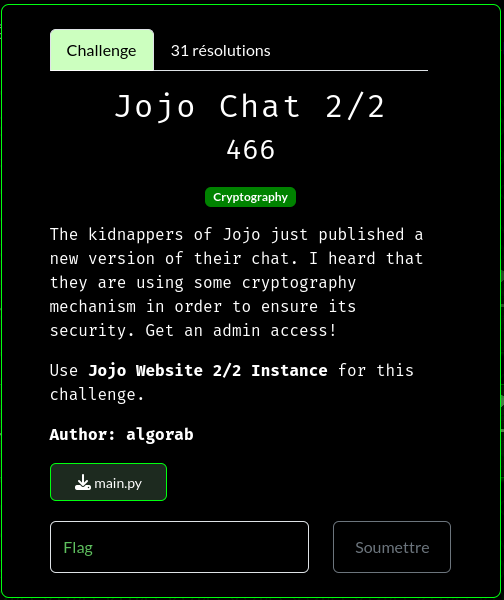
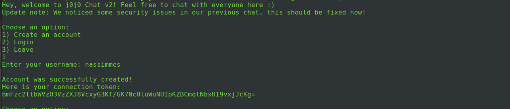
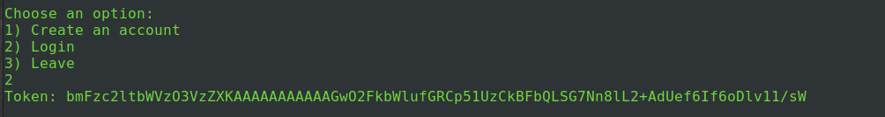
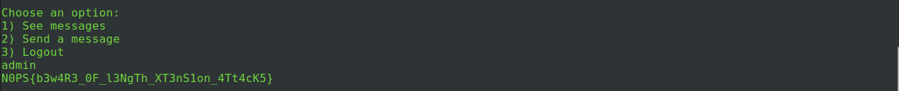

# N0PSctf 20244 Jojo Chat 2/2 writeup

## Challenge description




## Script :


```python 
import os
import hashlib
from datetime import datetime
import re
from base64 import b64encode, b64decode
from admin import admin

SECRET = B'XXXXXXXXXXXXXXXXXXXXXXXXXXXXXXXXXXXXXXXX'

def sign(username, is_admin=False):
    if is_admin:
        sig = hashlib.sha256(SECRET + username.encode() + b";admin").digest()
        return b64encode(username.encode() + b";admin|" + sig)
    else:
        sig = hashlib.sha256(SECRET + username.encode() + b";user").digest()
        return b64encode(username.encode() + b";user|" + sig)
    
def verify(token):
    data = b64decode(token)
    block, sig = data.split(b"|")[0], data.split(b"|")[1]
    if hashlib.sha256(SECRET + block).digest() != sig:
        return False
    return True

def sort_messages(messages):
    try:
        messages.sort(key=lambda x: datetime.strptime(x[1][:19], "%Y-%m-%d %H:%M:%S"))
    except:
        pass
    return messages

def create_account():
    name = input("Enter your username: ")
    names = os.listdir("./log")
    while hashlib.sha256(name.encode()).hexdigest() in names:
        name = input("This username is already used! Enter another one: ")
    if not re.match("^[A-Za-z0-9]+$", name):
        print("\nEmpty usernames are forbidden, and you can only use uppercases, lowercases and numbers, you hacker!")
        exit()
    log = open(f"./log/{hashlib.sha256(name.encode()).hexdigest()}", 'w')
    log.write(f"Username : {name}\n")
    token = sign(name)
    print("\nAccount was successfully created!\nHere is your connection token:\n"+token.decode())
    log.close()

def connect():
    token = input("Token: ")
    if not verify(token):
        return False, None, None
    name = b64decode(token).split(b";")[0].decode()
    names = os.listdir("./log")
    while not(hashlib.sha256(name.encode()).hexdigest() in names):
        token = input("This user does not exists! Token: ")
        if not verify(token):
            return False, None, None
        name = b64decode(token).split(b";")[0].decode()
    role = b64decode(token).split(b"|")[0].split(b";")[-1].decode()
    return True, name, role

def get_all_messages():
    names = os.listdir("./log")
    messages = []
    for name in names:
        with (open(f"./log/{name}", 'r')) as log:
            username = log.readline().split(" : ")[1][:-1]
            for line in log.readlines():
                messages.append((username, line))
    return sort_messages(messages)

def send_message(name):
    message = input("Enter your message: ")
    with (open(f"./log/{hashlib.sha256(name.encode()).hexdigest()}", 'a')) as log:
        log.write(f"{datetime.now().strftime('%Y-%m-%d %H:%M:%S')} {message}\n")
    print("\nYour message has been sent!")

connected = False

print("Hey, welcome to j0j0 Chat v2! Feel free to chat with everyone here :)\nUpdate note: We noticed some security issues in our previous chat, this should be fixed now!")

while True:
    if not connected:
        option = input("\nChoose an option:\n1) Create an account\n2) Login\n3) Leave\n")
        match option:
            case "1":
                create_account()
            case "2":
                connected, name, role = connect()
                if not(connected):
                    print("Incorrect token!")
            case "3":
                print("Bye! Come back whenever you want!")
                exit()
    else:
        option = input("\nChoose an option:\n1) See messages\n2) Send a message\n3) Logout\n")
        match option:
            case "1":
                print()
                messages = get_all_messages()
                for message in messages:
                    print(f"{message[0]} : {message[1][20:]}", end="")
            case "2":
                send_message(name)
            case "3":
                print("\nYou successfully logged out!")
                connected = False
                role = None
            case "admin":
                if role == "admin":
                    admin()
```

According to the description to solve this challenge we need to get admin access 

The code is offering us 3 options:

1) Create an account
2) Login 
3) Leave


First we try to create an account, the script will ask for a username with only alphanumeric characters and empty name is not allowed with a regex checking:

```python
    if not re.match("^[A-Za-z0-9]+$", name):
        print("\nEmpty usernames are forbidden, and you can only use uppercases, lowercases and numbers, you hacker!")
        exit()
```

in addition if the username already exists we will be rejected but it doesn't matter because to check whether we are admin or not the script will verify only our role and not the username:

```python 
    role = b64decode(token).split(b"|")[0].split(b";")[-1].decode()
    return True, name, role
```


So let's say my username is nassimmes, once the system creates my user he prints my token encoded in base64 to use to connect:




"bmFzc2ltbWVzO3VzZXJ8VcxyG3KT/GK7NcUluWuNUIpKZBCmqtNbxHI9vxjJcKg="

the token is generated using this function:
```python 
def sign(username, is_admin=False):
    if is_admin:
        sig = hashlib.sha256(SECRET + username.encode() + b";admin").digest()
        return b64encode(username.encode() + b";admin|" + sig)
    else:
        sig = hashlib.sha256(SECRET + username.encode() + b";user").digest()
        return b64encode(username.encode() + b";user|" + sig)
```

While is_admin is always set to false my token is a concatenation of ${username};user|${signature} and the sinature is calculated as following:

sha256(${SECRET}${username};user)

the decoded value of my token:

```
b'nassimmes;user|U\xccr\x1br\x93\xfcb\xbb5\xc5%\xb9k\x8dP\x8aJd\x10\xa6\xaa\xd3[\xc4r=\xbf\x18\xc9p\xa8'
```

So our goal here is to create a fake token which contains ;admin at the end, and to do that we have 2 issues:

1- we can not create user with ';' because of regex restrictions
2- if we try to fake the token the system will verify the siganture using a secret as salt in the preimage of hash wich is uknown for us:

```python 
def verify(token):
    data = b64decode(token)
    block, sig = data.split(b"|")[0], data.split(b"|")[1]
    if hashlib.sha256(SECRET + block).digest() != sig:
        return False
    return True 
```


I started by checking if i can bypass the regex but it didnt work for me, so the solution seems to be about the hash, as i know brute force a hash or decode it is not possible and the only thing i knew from CTFs proof of works we can bruteforce a preimage starting with specific prefix to get hash wich ends with 4 hexadecimal digits similar to a taret hash


After reseachs i found this github repo [link for hhash extender](https://github.com/iagox86/hash_extender) and from it's descreption it's interesting this is exactly what we want:

```
An application is susceptible to a hash length extension attack if it prepends a secret value to a string, hashes it with a vulnerable algorithm, and entrusts the attacker with both the string and the hash, but not the secret. Then, the server relies on the secret to decide whether or not the data returned later is the same as the original data.
```

I clonned the repo and i laucnhed it as following : 

```
./hash_extender -f sha256 -d "nassimmes;user" -s 55cc721b7293fc62bb35c525b96b8d508a4a6410a6aad35bc4723dbf18c970a8 -a ";admin" -l 40
```

when :
d is the right preimage value for my sinature
a is the data to append
s is my sgnature (right value after '|') encoded in hex
l is the secret length (guessed from the fake secret in the script)

The answer i've got:

```
Type: sha256
Secret length: 40
New signature: 6442a79d54cc290115b40b486ecd9fc94bdbe01d51e7fa21fea80e5bf5d7fb16
New string: 6e617373696d6d65733b75736572800000000000000001b03b61646d696e
```
 
The first line is the new signature, while the second is the new right part of preimage:

```python 
>>> bytes.fromhex("6e617373696d6d65733b75736572800000000000000001b03b61646d696e")
b'nassimmes;user\x80\x00\x00\x00\x00\x00\x00\x00\x01\xb0;admin'
```

Awesome now all i have to do is to join this values with '|' and encode the result in base64:

```python 
>>> b64encode(bytes.fromhex("6e617373696d6d65733b75736572800000000000000001b03b61646d696e")+b"|"+bytes.fromhex("6442a79d54cc290115b40b486ecd9fc94bdbe01d51e7fa21fea80e5bf5d7fb16"))
b'bmFzc2ltbWVzO3VzZXKAAAAAAAAAAAGwO2FkbWlufGRCp51UzCkBFbQLSG7Nn8lL2+AdUef6If6oDlv11/sW'
```

We login with the new token : 



Then we type admin:


And we get the flag:

```
N0PS{b3w4R3_0F_l3NgTh_XT3nS1on_4Tt4cK5}
```

be ware of length extension attacks
