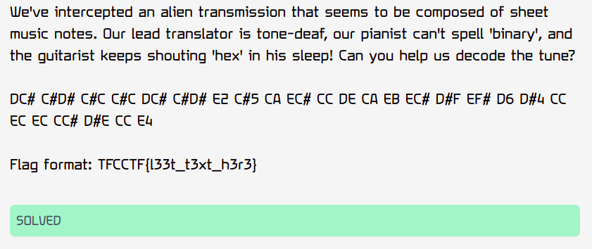
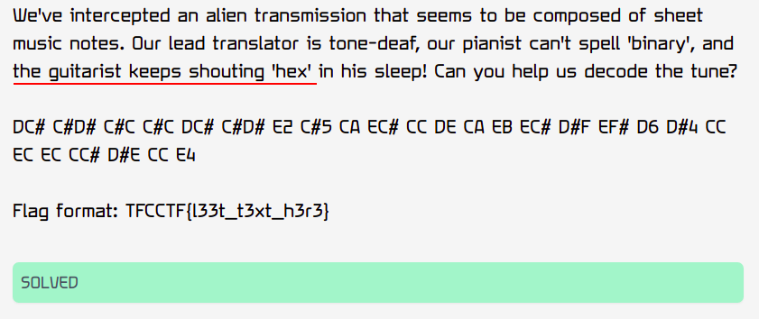
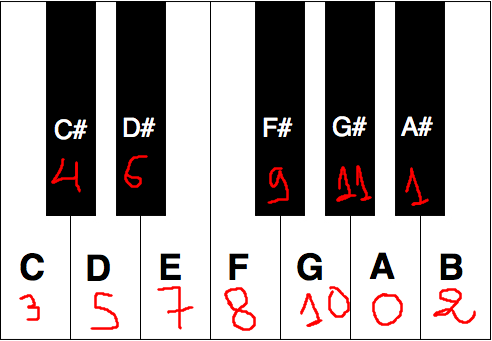

# TFCCTF 2023 writeup

## Challenge description



In the beginning i was a bit lost because i never seen a cipher using notes, i did researchs and i just found **Solfa Cipher Secrets** but it didnt help me..

Let's analyse the cipher message: 

```DC# C#D# C#C C#C DC# C#D# E2 C#5 CA EC# CC DE CA EB EC# D#F EF# D6 D#4 CC EC EC CC# D#E CC E4```


As we know the flag should start with ```"TFCCTF{"``` and ends with ```"}"```

We can guess that :

```
'T'=DC#
'F'=C#D#
'C'=C#C
'{'=E2
'}'=E4
```

We notice that C and F are little bit similar and this is logical because they are so close in alphabet


After reding the description for a second time i found that we have an interesting hint:




So the author is insisting on 'hex' and here we have couples of notes and we know that with a couple of hex we can encode chars from 0 to 255 wich coevers all ascii table characters: 

```
>>> int("00",16)
0
>>> int("FF",16)
255
```

Let's do some test on 'C' and 'F'. We have :

```
>>> ord('C')
67
>>> hex(ord('C'))
'0x43'
>>> ord('F')
70
>>> hex(ord('F'))
'0x46'
```

As we can see both of them share the same left hexadecimal value '4' wich is represented by C# in note. so we need to have a kind of projection where C# position is 4, C => 3 , D# => 6


We can try something on piano notes :



it seems to work with this.. 

To make sure i tried to encode 'T' : 

```
>>> hex(ord('T'))
'0x54'
```

wich is correct because 5 is the projection of D and 4 is C#


The only issue i found here is how to decode numeric notes like in E4 we dont know what's the mirror of 4. here i've got an idea to put just the alphabet letter in the 4th position (D in this case) so E4 is 
7D:

```
>>> chr(int("7D",16))
'}'
```

Now we are done with guessing let's write some code : 

python3```
notes = ["A","A#","B","C","C#","D","D#","E","F","F#","G","G#","1","2","3","4","5","6"]
cipher = "DC# C#D# C#C C#C DC# C#D# E2 C#5 CA EC# CC DE CA EB EC# D#F EF# D6 D#4 CC EC EC CC# D#E CC E4"
cipher = "".join([" "+cipher[i:i+2] if (i< len(cipher)-1 and cipher[i:i+2] in notes) else " "+cipher[i] if cipher[i] in notes else " " if cipher[i] == "" else "" for i in range(len(cipher))]).split(" ")[1:]
alphaHex = "ABCDEF"


#no need for decimal notes
notes = notes[:12]
print(notes)
message=''
for i in range(0,len(cipher),2):
	print(cipher[i:i+2])
	h1=cipher[i]
	h1=str(notes.index(h1)) if h1 in notes else alphaHex[int(h1)-1]
	h2=cipher[i+1]
	h2=str(notes.index(h2)) if h2 in notes else alphaHex[int(h2)-1]
	print(h1+h2)
	message+=chr(int(h1+h2,16))


print(message)

```


## FLAG:
```
TFCCTF{N0t3W0rthy_m3ss4g3}
```

Note a worthy messaes :)

