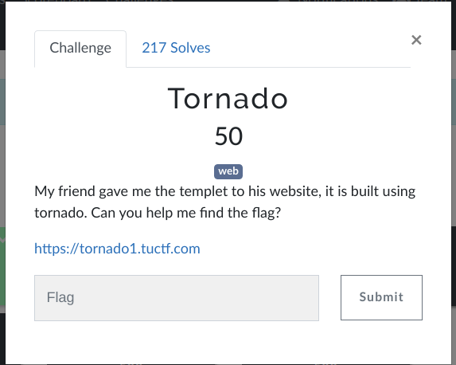

# TUCTF 2022 writeup

## Challenge description



When we folow our network activites we can find that a cookies is present with boolean value :


I changed its value to "yes" insted of "no" also when we send input we have a hidden message in namecheck page:


I tried many values for the cookie but nothing happend, next i did few research about Tornado and i found that's a python server and one of its vulnirabilities is that e can inject some python code like this  {{your_code}}


I typed this one and i ve got an interesting error : 


as we can see we have the path of the script, let's try to open it with this comand:

```
{{open("/app/web2.py").read()}}
```
Amazing we have our flag!


