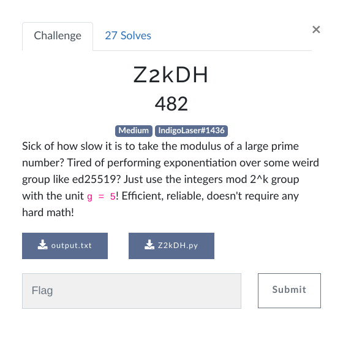

# Wolvctf 2023 Z2kDH writeup

## Challenge description




## output.txt content :

```
99edb8ed8892c664350acbd5d35346b9b77dedfae758190cd0544f2ea7312e81
40716941a673bbda0cc8f67fdf89cd1cfcf22a92fe509411d5fd37d4cb926afd

```


## the challenge's script :


```python 
#!/usr/bin/python3

modulus = 1 << 258

def Z2kDH_init(private_exponent):
	"""
	Computes the public result by taking the generator 5 to the private exponent, then removing the last 2 bits
	private_exponent must be a positive integer less than 2^256
	"""
	return pow(5, private_exponent, modulus) // 4

def Z2kDH_exchange(public_result, private_exponent):
	"""
	Computes the shared secret by taking the sender's public result to the receiver's private exponent, then removing the last 2 bits
	public_result must be a non-negative integer less than 2^256
	private_exponent must be a positive integer less than 2^256
	"""
	return pow(public_result * 4 + 1, private_exponent, modulus) // 4

alice_private_exponent = int(open('alice_private_exponent.txt').read(), 16)
bob_private_exponent = int(open('bob_private_exponent.txt').read(), 16)

alice_public_result = Z2kDH_init(alice_private_exponent)
bob_public_result = Z2kDH_init(bob_private_exponent)

# These are sent over the public channel:
print(f'{alice_public_result:064x}') # Alice sent to Bob
print(f'{bob_public_result:064x}')   # Bob sent to Alice

alice_shared_secret = Z2kDH_exchange(bob_public_result, alice_private_exponent)
bob_shared_secret = Z2kDH_exchange(alice_public_result, bob_private_exponent)

assert alice_shared_secret == bob_shared_secret # the math works out!

# ...Wait, how did they randomly end up with this shared secret? What a coincidence!

```

We can understand from the script that's alice and bob are exchaning public keys (so it's an asyetric algorithm). First they generate a public key from their hidden private key then they generate a shared key 


At the end of the script we have this question:

```
# ...Wait, how did they randomly end up with this shared secret? What a coincidence!

```

Let's answer this question first, why alice and bob ends up with same value? 

We have :

```
(1) - bob_public_key = (5 ** bob_private_key) %  modulus // 4
(2) - bob_shared_key = (alice_public_key *4+1  ** bob_private_key) %  modulus // 4


(3) - alice_public_key = (5 ** alice_private_key) %  modulus // 4
(4) - alice_shared_key = (bob_public_key *4+1  ** alice_private_key) %  modulus // 4

```


By replacing (3) in (2) and (1) in (4) we have : 

```
(1)' bob_shared_key = ( (5 ** alice_public_key) %  modulus ** bob_private_key) % modulus // 4
(2)' alice_shared_key = ( (5 ** bob_public_key) %  modulus ** alice_private_key) %  modulus // 4

```

So bob_shared_key share the same value with alice_shared_key

From (1) and (2) we have also: 

```

(1)'' (5 ** bob_private_key) % modulus  = (bob_public_key *4+1)
(2)'' (5 ** alice_private_key) % modulus  = (alice_public_key *4+1)


```


As we have both alice and bob's public keys our issue here is to find their private keys and to do that we need to solve (1)'' and (2)''


After searching i found a way to solve the equation accoriding to a method called discrete_log, we can import it from sympy.ntheory


```python 
from sympy.ntheory import discrete_log
```


With this i was able to find privates keys, but i was wondering where is the message ! I realised too that the key exchange methode is called Diffie-Hellman key exchange => link for more info : [link for more details](https://simple.wikipedia.org/wiki/Diffie-Hellman_key_exchange) 


After many tries i found it. All we need to do is to transform the shared key to ascii and we'll have the flag :)


## My script


```python 
#!/usr/bin/python3
import math
modulus = 1 << 258
from sympy.ntheory import discrete_log
def Z2kDH_init(private_exponent):
	return pow(5, private_exponent, modulus) // 4

def Z2kDH_exchange(public_result, private_exponent):
	return pow(public_result * 4 + 1, private_exponent, modulus) // 4

alice_public_result = int('99edb8ed8892c664350acbd5d35346b9b77dedfae758190cd0544f2ea7312e81',16)
bob_public_result =   int('40716941a673bbda0cc8f67fdf89cd1cfcf22a92fe509411d5fd37d4cb926afd',16)

alice_private_exponent = discrete_log(modulus, (alice_public_result *4+1), 5)
bob_private_exponent = discrete_log(modulus, (bob_public_result  *4+1), 5)


print("alice_private_key =",alice_private_exponent)
print("bob_private_key =",bob_private_exponent)

# These are sent over the public channel:
print(f'{alice_public_result:064x}') # Alice sent to Bob
print(f'{bob_public_result:064x}')   # Bob sent to Alice

alice_shared_secret = Z2kDH_exchange(bob_public_result, alice_private_exponent)
bob_shared_secret = Z2kDH_exchange(alice_public_result, bob_private_exponent)
print("alice_shared_secret =",alice_shared_secret)
print("bob_shared_secret =",bob_shared_secret)
assert alice_shared_secret == bob_shared_secret # the math works out!

print("flag =",int.to_bytes(int(alice_shared_secret), length=64, byteorder='big', signed=False))
```

## Result

```
alice_private_key = 88617125774223989137279841031386538078792427262478144097382619232683487654785
bob_private_key = 69947315579892770092783119506827871194729016493671781148325770395663533284821
99edb8ed8892c664350acbd5d35346b9b77dedfae758190cd0544f2ea7312e81
40716941a673bbda0cc8f67fdf89cd1cfcf22a92fe509411d5fd37d4cb926afd
alice_shared_secret = 54000950206298947573043565015778069038612029686203716605119284947562957452157
bob_shared_secret = 54000950206298947573043565015778069038612029686203716605119284947562957452157
flag = b'\x00\x00\x00\x00\x00\x00\x00\x00\x00\x00\x00\x00\x00\x00\x00\x00\x00\x00\x00\x00\x00\x00\x00\x00\x00\x00\x00\x00\x00\x00\x00\x00wctf{P0HL1G_H3LLM4N_$M4LL_pr1M3}
```
## Flag
```
wctf{P0HL1G_H3LLM4N_$M4LL_pr1M3}
```


