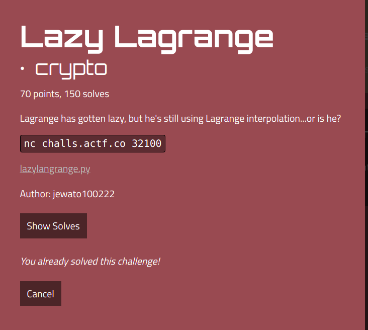
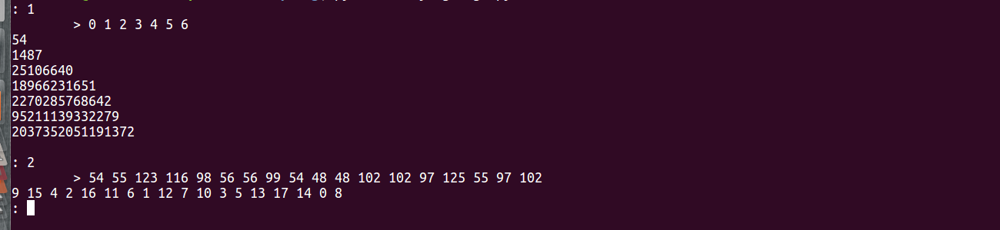

# angstromctf 2023 writeup

## Challenge description




## Script :

```python
#!/usr/local/bin/python
import random

with open('flag.txt', 'r') as f:
	FLAG = f.read()

assert all(c.isascii() and c.isprintable() for c in FLAG), 'Malformed flag'
N = len(FLAG)
assert N <= 18, 'I\'m too lazy to store a flag that long.'
p = None
a = None
M = (1 << 127) - 1

def query1(s):
	if len(s) > 100:
		return 'I\'m too lazy to read a query that long.'
	x = s.split()
	if len(x) > 10:
		return 'I\'m too lazy to process that many inputs.'
	if any(not x_i.isdecimal() for x_i in x):
		return 'I\'m too lazy to decipher strange inputs.'
	x = (int(x_i) for x_i in x)
	global p, a
	p = random.sample(range(N), k=N)
	a = [ord(FLAG[p[i]]) for i in range(N)]
	res = ''
	for x_i in x:
		res += f'{sum(a[j] * x_i ** j for j in range(N)) % M}\n'
	return res

query1('0')

def query2(s):
	if len(s) > 100:
		return 'I\'m too lazy to read a query that long.'
	x = s.split()
	if any(not x_i.isdecimal() for x_i in x):
		return 'I\'m too lazy to decipher strange inputs.'
	x = [int(x_i) for x_i in x]
	while len(x) < N:
		x.append(0)
	z = 1
	for i in range(N):
		z *= not x[i] - a[i]
	return ' '.join(str(p_i * z) for p_i in p)

while True:
	try:
		choice = int(input(": "))
		assert 1 <= choice <= 2
		match choice:
			case 1:
				print(query1(input("\t> ")))
			case 2:
				print(query2(input("\t> ")))
	except Exception as e:
		print("Bad input, exiting", e)
		break
```

## Understanding the script :

From the script we can understand that the flag contains only ascii characters that are stored in an array with their Decimal values. 
 


Now let's analyse query1 functions: 

we notice that once we launch this function the array is shuffled randomly, we can pass a list of decimal values and we get a sum or each x_i as following 

```
a_0 * x_i^0 + a_1 * x_i^1 + a_2 * x_i^2 ... a_n * x_i^n (with n == lenght of array)

```

While 0^0 is equal to 1 we can have the value of a_0 from the shuffled array (here i've got an idea to ask the server many time with query 1 and x_0 = 0 to retrive the used characters in the FLAG. this will help me to reduce the search time.


To do that i opened a socket and i asked server 100 times :


```python
import socket
from z3 import *
s = socket.socket(socket.AF_INET, socket.SOCK_STREAM)
s.connect(("challs.actf.co", 32100))
candidate = []
for i in range(100):


	s.sendall(str(1).encode(encoding = 'UTF-8')+ b"\n")

	data = s.recv(1200)

	data = data.decode().split("\n")

	s.sendall(str(0).encode(encoding = 'UTF-8')+ b"\n")

	data = s.recv(1200)

	data = data.decode().split("\n")
	v = int(data[0])
	if(not( v in candidate)):
		candidate.append(v)

print(candidate)
```

## Result:

```
>>> [48, 55, 102, 123, 98, 99, 54, 97, 56, 125, 116]
```


To make sure i replied the script twice and i had the same result so now i have FLAG characters, all i need to do is to find it's length (some characeters may be used more than one time) and the original index for each character


As i'm artificial intelligence and deep learning graduate i'm fan of sat solvers wich are part of classicial AI. I said by my self we can solve the equation system with z3 (sat solver in python) with the followings constraints :


```
a_0 = query1(0)
a_0 * 1^0 + a_1 * 1^1 + a_2 * 1^2 ... a_n *1^n = query1(1)
.
.
.

```


You'll notice that i ignored modulo here because m is huge and my results never been greater than m so no need to the reminder


Let's move to query2. To make it simple this function is asking us for the shuffled array values,if we pass them in the right order it will show us back their original indexes in the FLAG, otherwise if we do one mistake it will return list of zeros.

In both cases this function will give us information about the FLAG's lenght (18 in our case)


Now i'll modelise my probleme is z3. First i declare variables:

```python
for i in range(18):
	exec("x"+str(i)+" = Int('x"+str(i)+"')")
```


Next step i call server with query1 and i create an equation system:

```python
def rec(n,x):
	op='('
	for i in range(n):
		op+="x"+str(i)+"*"+str(x)+"**"+str(i)+"+"
	return(op)


s = socket.socket(socket.AF_INET, socket.SOCK_STREAM)
s.connect(("challs.actf.co", 32100))
data = s.recv(1200)
data = data.decode().split("\n")
s.sendall(str(1).encode(encoding = 'UTF-8')+ b"\n")
data = s.recv(1200)
data = data.decode().split("\n")
s.sendall('0 1 2 3 4 5 6'.encode(encoding = 'UTF-8')+ b"\n")
data = s.recv(1200)
data = data.decode().split("\n")
print(data)
num0 = data[0]
num1 = data[1]
num2 = data[2]
num3 = data[3]
num4 = data[4]
num5 = data[5]
num6 = data[6]


op=''
op+=rec(18,0)[:-1]+ ") == "+num0 +" ,"
op+=rec(18,1)[:-1]+ ") == "+num1 +" ,"
op+=rec(18,2)[:-1]+ ")== "+num2 +" ,"
op+=rec(18,3)[:-1]+ ") == "+num3 +" ,"
op+=rec(18,4)[:-1]+ ") == "+num4 

print(op)

```

## Result:
```
>>> op
'(x0*0**0+x1*0**1+x2*0**2+x3*0**3+x4*0**4+x5*0**5+x6*0**6+x7*0**7+x8*0**8+x9*0**9+x10*0**10+x11*0**11+x12*0**12+x13*0**13+x14*0**14+x15*0**15+x16*0**16+x17*0**17) == 54 ,(x0*1**0+x1*1**1+x2*1**2+x3*1**3+x4*1**4+x5*1**5+x6*1**6+x7*1**7+x8*1**8+x9*1**9+x10*1**10+x11*1**11+x12*1**12+x13*1**13+x14*1**14+x15*1**15+x16*1**16+x17*1**17) == 1487 ,(x0*2**0+x1*2**1+x2*2**2+x3*2**3+x4*2**4+x5*2**5+x6*2**6+x7*2**7+x8*2**8+x9*2**9+x10*2**10+x11*2**11+x12*2**12+x13*2**13+x14*2**14+x15*2**15+x16*2**16+x17*2**17)== 25106640 ,(x0*3**0+x1*3**1+x2*3**2+x3*3**3+x4*3**4+x5*3**5+x6*3**6+x7*3**7+x8*3**8+x9*3**9+x10*3**10+x11*3**11+x12*3**12+x13*3**13+x14*3**14+x15*3**15+x16*3**16+x17*3**17) == 18966231651 ,(x0*4**0+x1*4**1+x2*4**2+x3*4**3+x4*4**4+x5*4**5+x6*4**6+x7*4**7+x8*4**8+x9*4**9+x10*4**10+x11*4**11+x12*4**12+x13*4**13+x14*4**14+x15*4**15+x16*4**16+x17*4**17) == 2270285768642'


```

I noticed that solvig 5 equations is enough. Now i need to reduce the search space so i add the following consraints :

```python
for i in range(1,18):
	op+=",Or("
	op+=",".join(["x"+str(i)+" == "+str(c) for c in candidate])
	op+=")"
```

## Result:
```
>>> op
'(x0*0**0+x1*0**1+x2*0**2+x3*0**3+x4*0**4+x5*0**5+x6*0**6+x7*0**7+x8*0**8+x9*0**9+x10*0**10+x11*0**11+x12*0**12+x13*0**13+x14*0**14+x15*0**15+x16*0**16+x17*0**17) == 54 ,(x0*1**0+x1*1**1+x2*1**2+x3*1**3+x4*1**4+x5*1**5+x6*1**6+x7*1**7+x8*1**8+x9*1**9+x10*1**10+x11*1**11+x12*1**12+x13*1**13+x14*1**14+x15*1**15+x16*1**16+x17*1**17) == 1487 ,(x0*2**0+x1*2**1+x2*2**2+x3*2**3+x4*2**4+x5*2**5+x6*2**6+x7*2**7+x8*2**8+x9*2**9+x10*2**10+x11*2**11+x12*2**12+x13*2**13+x14*2**14+x15*2**15+x16*2**16+x17*2**17)== 25106640 ,(x0*3**0+x1*3**1+x2*3**2+x3*3**3+x4*3**4+x5*3**5+x6*3**6+x7*3**7+x8*3**8+x9*3**9+x10*3**10+x11*3**11+x12*3**12+x13*3**13+x14*3**14+x15*3**15+x16*3**16+x17*3**17) == 18966231651 ,(x0*4**0+x1*4**1+x2*4**2+x3*4**3+x4*4**4+x5*4**5+x6*4**6+x7*4**7+x8*4**8+x9*4**9+x10*4**10+x11*4**11+x12*4**12+x13*4**13+x14*4**14+x15*4**15+x16*4**16+x17*4**17) == 2270285768642,Or(x1 == 48,x1 == 55,x1 == 102,x1 == 98,x1 == 99,x1 == 54,x1 == 97,x1 == 56,x1 == 116,x1 == 123,x1 == 125),Or(x2 == 48,x2 == 55,x2 == 102,x2 == 98,x2 == 99,x2 == 54,x2 == 97,x2 == 56,x2 == 116,x2 == 123,x2 == 125),Or(x3 == 48,x3 == 55,x3 == 102,x3 == 98,x3 == 99,x3 == 54,x3 == 97,x3 == 56,x3 == 116,x3 == 123,x3 == 125),Or(x4 == 48,x4 == 55,x4 == 102,x4 == 98,x4 == 99,x4 == 54,x4 == 97,x4 == 56,x4 == 116,x4 == 123,x4 == 125),Or(x5 == 48,x5 == 55,x5 == 102,x5 == 98,x5 == 99,x5 == 54,x5 == 97,x5 == 56,x5 == 116,x5 == 123,x5 == 125),Or(x6 == 48,x6 == 55,x6 == 102,x6 == 98,x6 == 99,x6 == 54,x6 == 97,x6 == 56,x6 == 116,x6 == 123,x6 == 125),Or(x7 == 48,x7 == 55,x7 == 102,x7 == 98,x7 == 99,x7 == 54,x7 == 97,x7 == 56,x7 == 116,x7 == 123,x7 == 125),Or(x8 == 48,x8 == 55,x8 == 102,x8 == 98,x8 == 99,x8 == 54,x8 == 97,x8 == 56,x8 == 116,x8 == 123,x8 == 125),Or(x9 == 48,x9 == 55,x9 == 102,x9 == 98,x9 == 99,x9 == 54,x9 == 97,x9 == 56,x9 == 116,x9 == 123,x9 == 125),Or(x10 == 48,x10 == 55,x10 == 102,x10 == 98,x10 == 99,x10 == 54,x10 == 97,x10 == 56,x10 == 116,x10 == 123,x10 == 125),Or(x11 == 48,x11 == 55,x11 == 102,x11 == 98,x11 == 99,x11 == 54,x11 == 97,x11 == 56,x11 == 116,x11 == 123,x11 == 125),Or(x12 == 48,x12 == 55,x12 == 102,x12 == 98,x12 == 99,x12 == 54,x12 == 97,x12 == 56,x12 == 116,x12 == 123,x12 == 125),Or(x13 == 48,x13 == 55,x13 == 102,x13 == 98,x13 == 99,x13 == 54,x13 == 97,x13 == 56,x13 == 116,x13 == 123,x13 == 125),Or(x14 == 48,x14 == 55,x14 == 102,x14 == 98,x14 == 99,x14 == 54,x14 == 97,x14 == 56,x14 == 116,x14 == 123,x14 == 125),Or(x15 == 48,x15 == 55,x15 == 102,x15 == 98,x15 == 99,x15 == 54,x15 == 97,x15 == 56,x15 == 116,x15 == 123,x15 == 125),Or(x16 == 48,x16 == 55,x16 == 102,x16 == 98,x16 == 99,x16 == 54,x16 == 97,x16 == 56,x16 == 116,x16 == 123,x16 == 125),Or(x17 == 48,x17 == 55,x17 == 102,x17 == 98,x17 == 99,x17 == 54,x17 == 97,x17 == 56,x17 == 116,x17 == 123,x17 == 125)'
```

Then we pass the expression to the solver:

```
>>> exec("sol.add("+op+")")
>>> sol.check()
sat
>>> sol.model()
[x6 = 56,
 x2 = 123,
 x7 = 99,
 x3 = 116,
 x11 = 102,
 x12 = 102,
 x13 = 97,
 x4 = 98,
 x5 = 56,
 x17 = 102,
 x8 = 54,
 x14 = 125,
 x9 = 48,
 x10 = 48,
 x16 = 97,
 x15 = 55,
 x1 = 55,
 x0 = 54]

```

Perfect. after sloving the system we pass the result to query2 then we reorder the values according to the answer

```
>>> msg = str(m[x0])
>>> for i in range(1,18):
...     msg+= " "+str(m[eval("x"+str(i))])
>>> msg
'54 55 123 116 98 56 56 99 54 48 48 102 102 97 125 55 97 102'
```


## Query2 response:




## FLAG:
```
>>> indexes = "9 15 4 2 16 11 6 1 12 7 10 3 5 13 17 14 0 8".split(" ")
>>> msg = msg.split(" ")
>>> flag = "".join([ chr(int(msg[int(indexes.index(str(i)))])) for i in range(0,18)])
>>> flag
'actf{f80f6086a77b}'
```


## Full Script:

```python

import socket
import itertools
from z3 import *
sol = Solver() 

candidate = [48, 55, 102, 98, 99, 54, 97, 56, 116,123,125]
M = (1 << 127) - 1


def crk(a,x_i,M):
	return sum(a[j] * x_i ** j for j in range(18)) % M


def rec(n,x):
	op='('
	for i in range(n):
		op+="x"+str(i)+"*"+str(x)+"**"+str(i)+"+"
	return(op)


s = socket.socket(socket.AF_INET, socket.SOCK_STREAM)
s.connect(("challs.actf.co", 32100))
data = s.recv(1200)
data = data.decode().split("\n")
s.sendall(str(1).encode(encoding = 'UTF-8')+ b"\n")
data = s.recv(1200)
data = data.decode().split("\n")
s.sendall('0 1 2 3 4 5 6'.encode(encoding = 'UTF-8')+ b"\n")
data = s.recv(1200)
data = data.decode().split("\n")

num0 = data[0]
num1 = data[1]
num2 = data[2]
num3 = data[3]
num4 = data[4]
num5 = data[5]
num6 = data[6]

for i in range(18):
	exec("x"+str(i)+" = Int('x"+str(i)+"')")

op=''
op+=rec(18,0)[:-1]+ ") == "+num0 +" ,"
op+=rec(18,1)[:-1]+ ") == "+num1 +" ,"
op+=rec(18,2)[:-1]+ ")== "+num2 +" ,"
op+=rec(18,3)[:-1]+ ") == "+num3 +" ,"
op+=rec(18,4)[:-1]+ ") == "+num4 #+" ,"
#op+=rec(18,6)[:-1]+ " == "+num6


for i in range(1,18):
	op+=",Or("
	op+=",".join(["x"+str(i)+" == "+str(c) for c in candidate])
	op+=")"


exec("sol.add("+op+")")
sol.check()
print(sol.check())
sol.model()
m = sol.model()
print(m)

s.sendall(str(2).encode(encoding = 'UTF-8')+ b"\n")

data = s.recv(1200)

data = data.decode().split("\n")
print(data)

msg = str(m[x0])
for i in range(1,18):
	msg+= " "+str(m[eval("x"+str(i))])

print("msg =",msg)
s.sendall(msg.encode(encoding = 'UTF-8')+ b"\n")
data = s.recv(1200)
data = data.decode().split("\n")
print(data)


```
