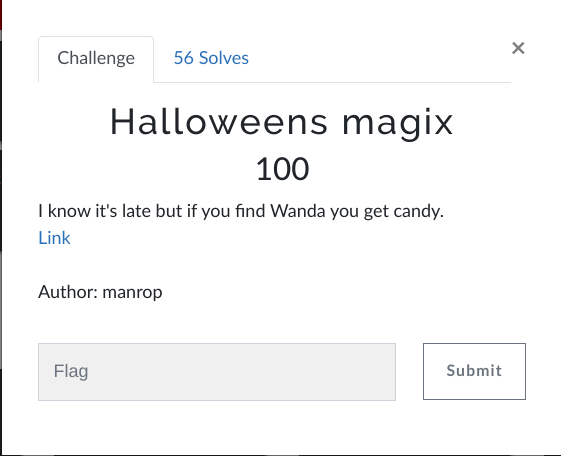

# isitdtu CTF 2022 writeup

## Challenge description



[link to challenge code and encrypted image](https://drive.google.com/drive/folders/1aTt8bHBiIwy_w0JFnnpCPsrNJqFn4MoB)


## Encryption code:

with simple view of code we can understand that a .png image is encrypted with random key 4x4 matrix
with values form 0 to 64 ==> 64 ^16 = 7,922816251×10²⁸ possibles combinaisons so the brute force is impossible..

Once the key is generated the image is splited in 16 lenght bytes then each byte is transformed to
4x4 matrix of integers according to bytes2matrix() function then multplied by the key and finaly transformed again to bytes and wrote in new file..

The main goal here is to understand each function, revert the code and find the key

Let's start with the function multiply(), this is a simple matrix multiplication same as dot() function from numpy, let's see if we can revert it easily..

To do i'll use sipmple 2x2 matrix:
```
>>> import numpy as np
>>> from sympy.matrices import Matrix
>>> A = [[1,2],[3,4]]
>>> x = [[5,6],[7,8]]
>>> np.dot(A,B)
Result = array([[19, 22],
       [43, 50]])

```
in algebra to resolve Ax = B we need to multply by the matrix inverse ==> x = B.A^-1

```
np.dot(np.array([[19, 22], [43, 50]]),np.array(Matrix([[5,6],[7,8]]).inv())).tolist()
Result = [[1, 2], [3, 4]]

```

I tried this in the other sens (solve x) but the result wasnt as i expected :( 

```
np.dot(np.array([[19, 22], [43, 50]]),np.array(Matrix([[1,2],[3,4]]).inv())).tolist()
Result = [[-5, 8], [-11, 18]]

```

After a search i found another way to do that with solve from sympy.linalg

```
>>> from scipy.linalg import solve
>>> key = solve(A,B)
>>> key
Result = array([[5., 6.],
       [7., 8.]])

```

**NB:** As we learnt in algebra some matrix are not inrevisbles so becarfull to chose your matrix when its about encryption


Now we are able to revert the multiplication, let's test the rest on functions, let's check if the function bytes2matrix() is the reel revert of bytes2matrix2() (it seem's not to be the case because of the pack of 'H!', to get the answer i'll test on my matrix result :

```
>>> cipher = bytes2matrix([[19, 22],[43, 50]])
>>> cipher
[[[19, 22], [43, 50]]]
>>> cipher = matrix2bytes([[19, 22],[43, 50]])
>>> cipher
b'\x00\x13\x00\x16\x00+\x002'
>>> plain = bytes2matrix(cipher)
>>> plain
[[0, 19, 0, 22], [0, 43, 0, 50]]
```

As expected the result is not the same and the length is up to 32 bytes, so i'll try te revert it : 

```
>>> cipher = matrix2bytes([[19, 22],[43, 50]])
>>> flatten = [unpack('!H',cipher[i:i+2])[0] for i in range(0, len(cipher), 2)]
>>> result = [ flatten[i:i+2] for i in range(0, len(flatten), 2)][0:4]
>>> result
[[19, 22], [43, 50]]

```

So my revert function will be like:

```
def revertmatrix2bytes(cipher,step):
	flatten = [unpack('!H',cipher[i:i+2])[0] for i in range(0, len(cipher), 2)]
	result = [ flatten[i:i+step] for i in range(0, len(flatten), step)][0:4]
	return result
```

Now w're done with reverting we need to find the key on encryption, to do that we will extract first 32 bytes from the encrypted .png, use the revertmatrix2bytes():


```
>>> data = open("flag.png", "rb").read()
>>> data[0:32]
b"/$/\x8e3\xae\x1cj\x05\x93\x07\xc9\x08\xd2\x03\xf0\x01\xc7\x01_\x01\xba\x00\x1a#;&Q'\xe0\x16|"
>>> s = revertmatrix2bytes(data[0:32],4)
>>> s
[[12068, 12174, 13230, 7274], [1427, 1993, 2258, 1008], [455, 351, 442, 26], [9019, 9809, 10208, 5756]]
```


Next we need to solve the multiplication, btw we are lucky that we can guess the first 16 bytes from the png because the headers of pngs is alays the same :)


So we extract the first 16 bytes from any png image:

```
>>> target = open("final.png", "rb").read()
>>> target[0:16]
b'\x89PNG\r\n\x1a\n\x00\x00\x00\rIHDR'
>>> bytes2matrix(target[0:16])
[[137, 80, 78, 71], [13, 10, 26, 10], [0, 0, 0, 13], [73, 72, 68, 82]]
```


In this step we have 2 matrixs, all we need to do is to find the key with the function that i mentioned before:

```
>>> key = solve([[137, 80, 78, 71], [13, 10, 26, 10], [0, 0, 0, 13], [73, 72, 68, 82]],[[12068, 12174, 13230, 7274], [1427, 1993, 2258, 1008], [455, 351, 442, 26], [9019, 9809, 10208, 5756]])
>>> key
array([[49., 31., 44., 16.],
       [31., 41., 15., 52.],
       [ 5., 35., 46., 10.],
       [35., 27., 34.,  2.]])
>>> key.tolist()
[[49.00000000000001, 31.0, 44.0, 16.000000000000007], [30.99999999999999, 41.0, 15.000000000000005, 51.99999999999999], [5.000000000000006, 35.00000000000001, 46.0, 10.000000000000002], [35.0, 27.0, 34.0, 2.0]]
```

Because im lazy -_- i transfroed the floats to integer by hand with a round, so the key be like:

```
key = [[49, 31, 44, 16], [31, 41, 15, 52], [5, 35, 46, 10], [35, 27, 34, 2]]
```

We are almost done now, the only thing to do is to correct the matrix2bytes() function because as we saw it is corrupted :

```
def correctmatrix2bytes(m):
	return b''.join([bytearray(i) for i in m])
```

## Final Code
```
from struct import pack,unpack
import random, time
import numpy as np
from sympy.matrices import Matrix
def bytes2matrix(b):
	return [list(map(lambda x : x, list(b[i:i+4]))) for i in range(0, len(b), 4)]

def matrix2bytes(m):
	return b''.join(map(lambda x : b''.join(map(lambda y : pack('!H', y), x)), m))


def revertmatrix2bytes(cipher,step):
	flatten = [unpack('!H',cipher[i:i+2])[0] for i in range(0, len(cipher), 2)]
	result = [ flatten[i:i+step] for i in range(0, len(flatten), step)][0:4]
	return result


def correctmatrix2bytes(m):
	return b''.join([bytearray(i) for i in m])

def multiply(A,B):
	C = [[0 for i in range(4)] for j in range(4)]
	for i in range(4):
		for j in range(4):
			for k in range(4):
				C[i][j] += A[i][k] * B[k][j]
	return C

def main():
	key = [[49, 31, 44, 16], [31, 41, 15, 52], [5, 35, 46, 10], [35, 27, 34, 2]]
	data = open("flag.png", "rb").read()
	out = open("flagclear.png", 'wb')
	for i in range(0, len(data), 32):
		splited = data[i:i+32]
		rf = revertmatrix2bytes(splited ,4)
		txt = np.dot(np.array(rf),np.array(Matrix(key).inv())).tolist()		
		out.write(correctmatrix2bytes(txt))
if __name__ == '__main__':
    main()

```


Open your flagclear.png, Congrats here is your flag: 


