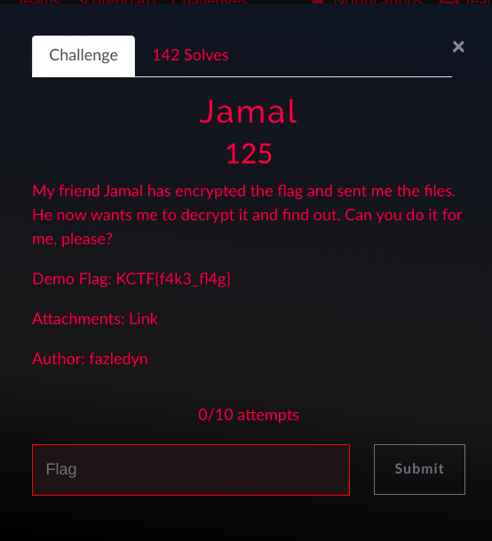

# KnightCTF 2023 writeup

## Challenge description




## Encryption code:

```
from random import randint, seed


def is_prime(n):
    if n == 2 or n == 3:
        return True
    if n % 2 == 0 or n < 2:
        return False
    for i in range(3, int(n**0.5)+1, 2):
        if n % i == 0:
            return False
    return True


def get_prime(n):
    while True:
        p = randint(2**(n-1), 2**n)
        if is_prime(p):
            return p


def encrypt(ch, g, p, y, k):
    pt_int = int.from_bytes(ch.encode(), "big")
    c1 = pow(g, k, p)
    c2 = (pt_int * pow(y, k, p)) % p

    return c1, c2


def main():
    
    flag = open("flag.txt", "r").read().strip()
    
    x = randint(2, 9999999)
    p = get_prime(43)
    g = get_prime(43)

    while g == p:
        g = get_prime(43)

    if g > p:
        g, p = p, g

    y = pow(g, x, p)

    with open("flag.enc", "w") as out:
        for ch in list(flag):
            #   encrypt
            k = randint(2, 9999)
            c1, c2 = encrypt(ch, g, p, y, k)
            out.write(f"{c1},{c2}\n")

    with open("key.pub", "w") as out:
        out.write(f"p: {p}\n")


if __name__ == "__main__":
    seed(0)
    main()
```


## Encryted message:

```
2542674357061,4847246713802
1047095110514,5442246326884
2241080680361,1245097740116
2877082899121,2015083390864
2962454333590,1146622182354
8667422468,2426235990011
3283797690288,1163330068886
92336276716,536192738869
280618016374,1050304813536
1209866491592,2557712370232
2253881281576,5215532211167
1161992879414,2958071253742
4818900557459,5041124092456
1794902833332,3591885406256
3082175285512,445112268638
1157352410430,3885016853134
1975682514838,3257619927935
940190944451,3252630199341
4892987552563,2871318171243
861276404486,2831581919021
5308919438905,2638919167036
```
## Public key:

```
p: 5690411473163
```


This is the first time i see this crypto algorithm wich is similar to RSA specialy the way we generate primes. I noticied too that the code is based on pseudo random generation so if we use the same seed() we will have the same random numbers sequence 

 
To make sure that the seed() was really initialized with 0, i printed the whole sequence of the random on my custom clear text :

```
x = 6463345
p = 5690411473163
g = 5627617642099
y = 5627617642099

k = 5083
k = 1620
k = 1210
k = 5411
k = 7737
k = 9173
k = 1651
k = 5798
k = 7115
k = 5182
k = 3352
k = 9054
k = 7817
k = 7255
k = 8543
k = 4269
k = 1022
k = 8991
k = 232
k = 1530
k = 6536
```

As we have the same p value no need to loop to find the right inisialitation :)


Now let's create a decrypt function.

The encryption is using the pseudo random values that we already know to generate two parts c1 & c2 and it's clear that our text is only hidden in the second part (c2)

```
pt_int = int.from_bytes(ch.encode(), "big")
c1 = pow(g, k, p)
c2 = (pt_int * pow(y, k, p)) % p
```

While we know the value of y,k,p each round the only missing value is ch, a caracter transformed to big integer. In order to find this integer we can loop over utf-8 values (looping from 0 to 255 is enought)


So our decrptyion code will be like bellow : 

```
x = randint(2, 9999999)
p = get_prime(43)
g = get_prime(43)
while g == p:
g = get_prime(43)

if g > p:
g, p = p, g

y = pow(g, x, p)
flag = open("jamal-flag.enc.txt", "r").read().strip()
line = flag.split("\n")
s=''
for couple in line:
	k = randint(2, 9999)
	fst,snd = couple.split(",")
	for ch in range(48,255):
	if((int.from_bytes(chr(ch).encode(), "big") * pow(y, k, p)) % p == int(snd)):
		s+=chr(ch)
print(s)
```

Decrrypted flag :

```
KCTF{h4v3_y0u_h34rd_0f_3l64m4l?}
```

Have you heard of elgamal? in leetcode :)

I checked this in wikipedia and i realised that's an asymmetric encryption system described by Taher Elgamal in 1985 [link for more inforations](https://en.wikipedia.org/wiki/ElGamal_encryption)

